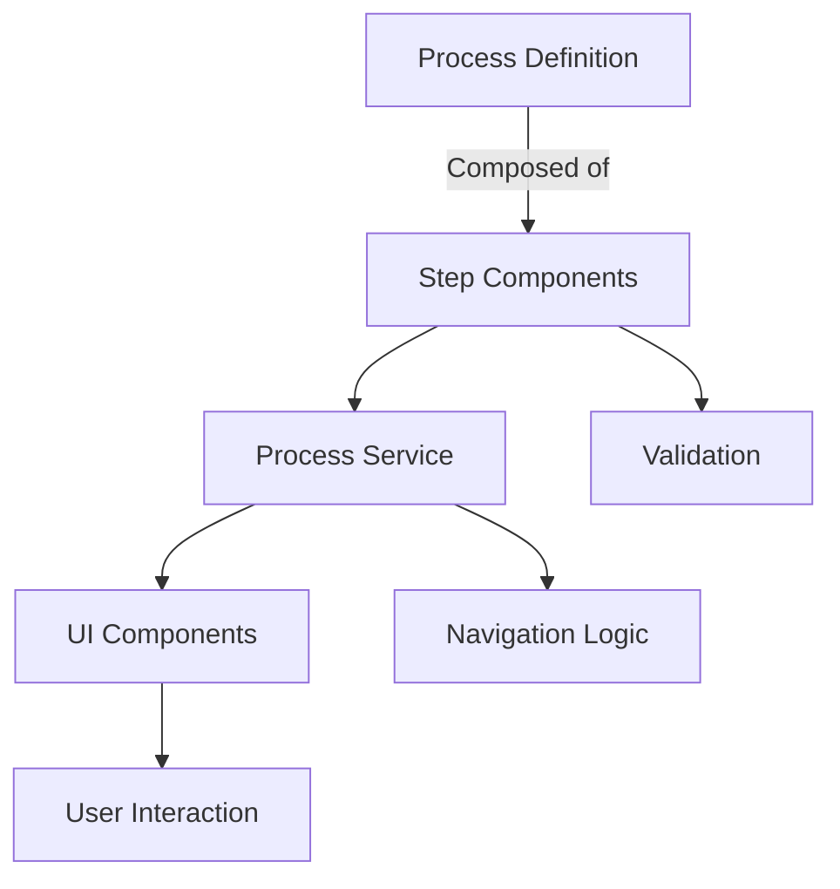

# Angular Business Process Engine

A modular Angular framework for building business processes as step-based workflows. This project enables you to
compose, visualize, and manage multi-step user flows using Angular components and services.

## Features

- **Composable Processes:** Define business processes as ordered steps using Angular components.
- **Step Navigation:** Built-in navigation (Next/Previous) and validation for each step.
- **Extensible:** Easily add new process steps and UI components.
- **Type-Safe:** Leverages TypeScript generics for input/output typing between steps.

## Architecture Overview



- **Process Definition:** Use the `process()` function to compose steps.
- **Step Components:** Angular components implementing the `StepComponent<In, Out>` interface.
- **Process Service:** Manages navigation and state between steps.
- **UI Components:** Render the process and navigation buttons.

## Example: Defining a Process

```typescript
import {process, step, summary} from 'src/lib/process-engine/process';
import {SelectUsernameComponent} from './select-username.component';
import {UserCreateComponent} from './user-create.component';

export const userCreateProcess = process(
    step(SelectUsernameComponent),
    step(UserCreateComponent),
    summary()
);
```

## Getting Started

1. **Install dependencies:**
   ```bash
   npm install
   # or
   bun install
   ```
2. **Run the development server:**
   ```bash
   ng serve
   ```
   Visit [http://localhost:4200](http://localhost:4200) in your browser.

## Project Structure

- `src/lib/process-engine/` – Core process engine logic and types
- `src/app/processes/` – Example business processes and steps
- `src/app/pages/` – Page components for routing

## Contributing

Contributions are welcome! Please open issues or submit pull requests for improvements or new features.

## License

MIT
